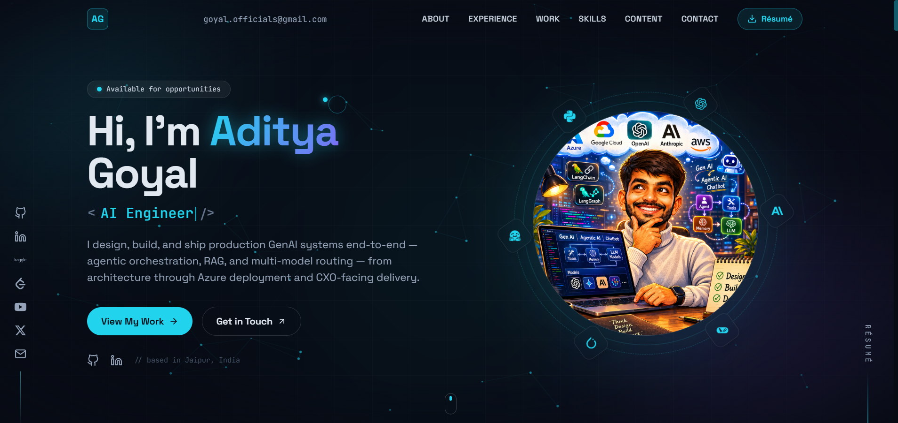

# Aditya Goyal — AI Engineer

> I design, build, and ship production GenAI systems end-to-end — agentic orchestration, RAG, and multi-model routing — from architecture through Azure deployment and CXO-facing delivery.

🔗 **Live:** _add your deployed URL here_

## 👋 About me

I'm an **AI Engineer** who designs and ships production-grade GenAI systems end-to-end — from
architecture and model selection through deployment. I like owning the whole stack: agentic
orchestration, retrieval-augmented generation, multi-model routing, LLM fine-tuning, and the
Python backends and cloud infra that put it all in production.

### What I do

- **GenAI & agentic systems** — multi-agent orchestration, tool / function calling, MCP, LangGraph & LangChain
- **RAG & knowledge systems** — vector search (FAISS, Chroma, LanceDB), knowledge graphs, chunking & grounding
- **LLM fine-tuning & ML** — LoRA, Unsloth, PyTorch, Hugging Face; NLP, computer vision, recommenders
- **Production & cloud** — FastAPI services, async orchestration, caching, CI/CD on Azure, AWS & GCP

### Also

- 🏅 **Kaggle Notebooks Master** — top-voted data-science notebooks
- 🎥 **DSA teaching channel** on YouTube
- 🧩 Active problem-solving on **LeetCode**

📍 Jaipur, India

## 🔗 Find me

[GitHub](https://github.com/I-AdityaGoyal) ·
[LinkedIn](https://www.linkedin.com/in/aditya-goyal-252698221/) ·
[Kaggle](https://www.kaggle.com/goyaladi) ·
[LeetCode](https://leetcode.com/u/_Adi-G/) ·
[YouTube](https://www.youtube.com/@I-AdityaGoyal) ·
[X](https://x.com/I_AdityaGoyal) ·
goyal.officials@gmail.com

---

Designed & built by Aditya Goyal.
